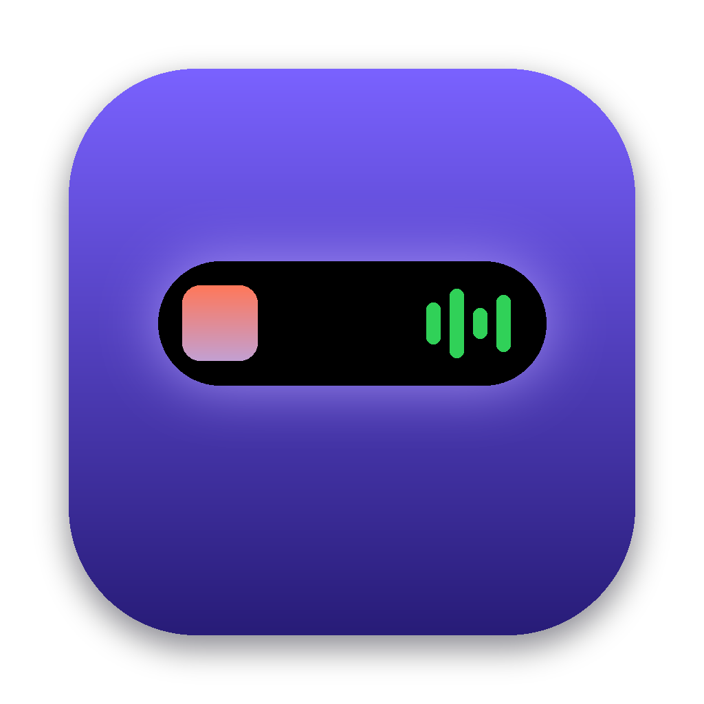
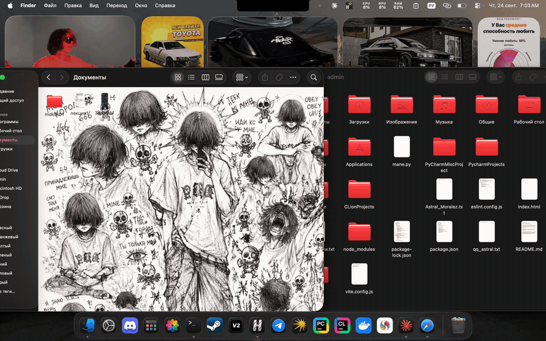

<p align="center">
  
</p>

<h1 align="center">Isle</h1>

<p align="center">
  Dynamic Island for the MacBook notch.<br>
  <b>C++20 · Qt 6 / QML · AppKit · MediaRemote · AppleScript · Objective-C++</b>
</p>

<p align="center">
  
</p>

<p align="center"><sub><b>English</b> · <a href="README.ru.md">Русский</a></sub></p>

---

The MacBook notch stops being dead space. Hover over it and it springs open into a panel, just like the Dynamic Island on iPhone.

## Features

- **Now playing.** Artwork, track, artist, progress and controls: play/pause, next, previous. When collapsed, the artwork and a live equalizer sit on either side of the notch.
- **Focus timer.** 5, 15, 25 and 45-minute presets, pause, +5 minutes. While it runs, the remaining time is shown right in the notch. When time's up, a chime plays and the notch opens on its own.
- **File shelf.** Drag a file onto the notch to park it there, then drag it out into any app: a messenger, Mail, Finder. Double-click opens the file, right-click reveals it in Finder. The shelf persists between launches.
- **Stays out of your way.** While collapsed, the window is click-through and the menu bar underneath works as usual. Expanding never makes Isle the active app, just like Spotlight.
- **Works without a notch too:** on external displays and older Macs a neat pill appears at the top center.

## How it works

```
src/
├── core/                    # no UI → covered by tests
│   ├── FocusTimer           # timer on a monotonic clock
│   └── ShelfModel           # shelf model + persistence
├── app/
│   ├── NotchController      # geometry, hover logic, click-through
│   ├── NowPlaying           # what's playing + controls
│   └── ImageStore           # artwork and file icons for QML
└── platform/
    ├── Native_mac.mm        # window above the menu bar, NSPanel, drag detection, SMAppService
    └── Media_mac.mm         # MediaRemote + AppleScript (Spotify, Music)
qml/                         # notch shape on QtQuick.Shapes, cards, animations
```

Notable decisions:

- **Notch size** comes from `NSScreen.safeAreaInsets` and `auxiliaryTopLeftArea/RightArea`. Collapsed, Isle matches the hardware notch pixel for pixel and blends into it.
- **Window above the menu bar**: `NSMainMenuWindowLevel + 3`, `NonactivatingPanel`, visible on every Space and over full-screen apps.
- **Click-through.** The window is large, but while collapsed it sets `ignoresMouseEvents = YES`. The cursor is polled 25 times a second, and click-through is lifted only when the cursor is over the island.
- **Telling a file drag from a menu click.** The `changeCount` of the system drag pasteboard is compared at mouse-down and during movement: if it changed, a drag-and-drop is in progress and the notch opens to meet it.
- **Two now-playing sources.** Private `MediaRemote` sees any player, but since macOS 15.4 Apple has locked it for third-party apps. So there's a fallback via AppleScript to Spotify and Music, with compiled scripts cached. Isle never talks to a player that isn't running — otherwise `tell application` would launch it.
- **Island shape** is a single `ShapePath` with rounded corners and concave "ears" at the screen edge. Width and height are driven by `SpringAnimation`, which gives the expansion its bounce.

## Building

```bash
brew install qt cmake ninja

# development
cmake -S . -B build -G Ninja -DCMAKE_PREFIX_PATH="$(brew --prefix qt)"
cmake --build build && ctest --test-dir build
./build/Isle.app/Contents/MacOS/Isle

# standalone app + .dmg + install to /Applications
./scripts/package.sh --install
```

On first playback macOS will ask "Isle wants to control Spotify / Music". Click Allow, otherwise Isle can't see what's playing.

## License

MIT
