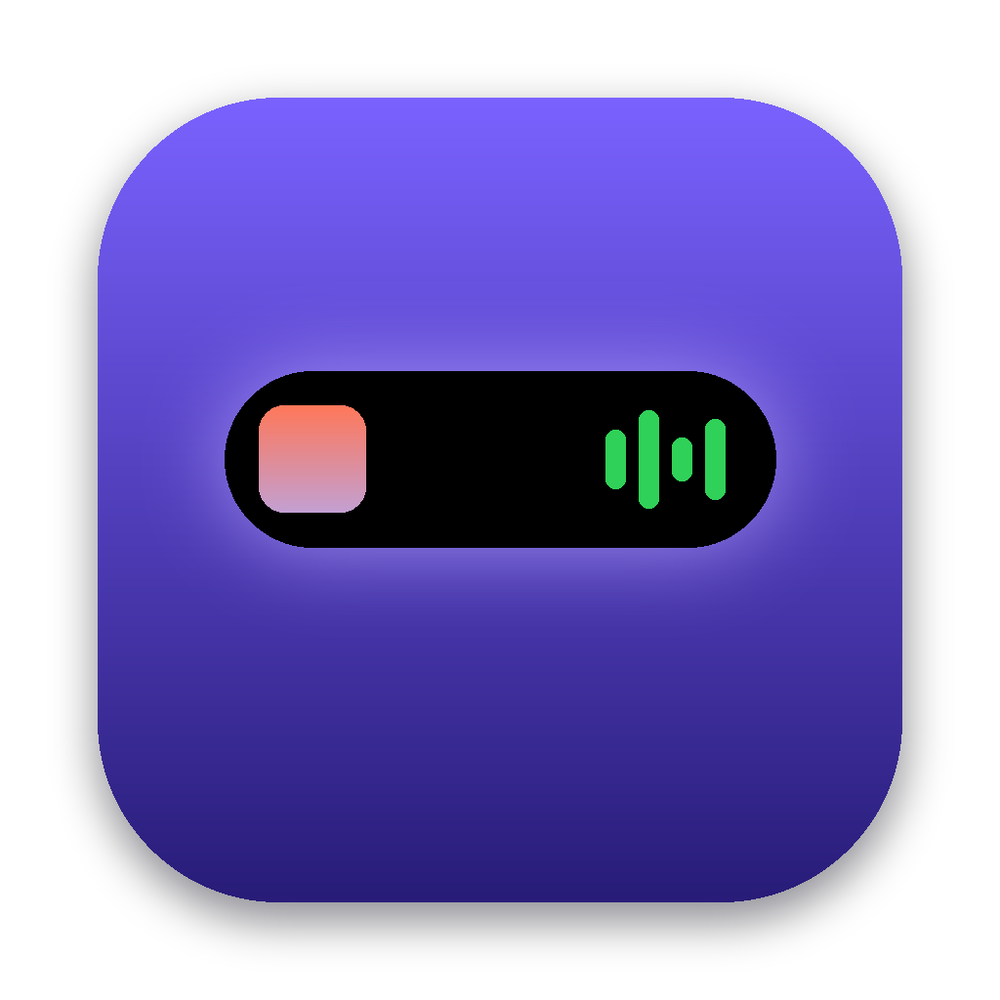
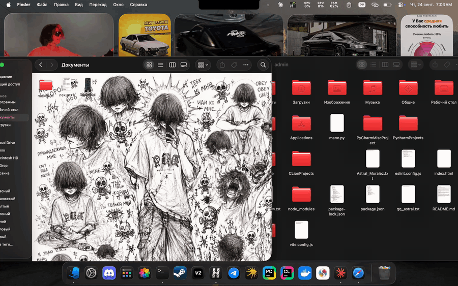

<p align="center">
  
</p>

<h1 align="center">Isle</h1>

<p align="center">
  Dynamic Island для чёлки MacBook.<br>
  <b>C++20 · Qt 6 / QML · AppKit · MediaRemote · AppleScript · Objective-C++</b>
</p>

<p align="center">
  
</p>

<p align="center"><sub><a href="README.md">English</a> · <b>Русский</b></sub></p>

---

Чёлка MacBook перестаёт быть мёртвой зоной. Наводишь на неё курсор, и она «пружинисто» раскрывается в панель, как Dynamic Island на iPhone.

## Что умеет

- **Музыка.** Обложка, трек, исполнитель, прогресс и управление: пауза, следующий, предыдущий. В свёрнутом виде по краям чёлки видны обложка и живой эквалайзер.
- **Таймер фокуса.** Пресеты на 5, 15, 25 и 45 минут, пауза, +5 минут. Пока идёт отсчёт, оставшееся время видно прямо в чёлке. Когда время вышло, звучит сигнал и чёлка раскрывается сама.
- **Полка для файлов.** Перетаскиваешь файл на чёлку, и он «паркуется». Потом его можно вытащить в любое приложение: мессенджер, почту, Finder. Двойной клик открывает файл, правый клик показывает его в Finder. Полка сохраняется между запусками.
- **Не мешает работать.** Пока чёлка свёрнута, окно прозрачно для мыши, и строка меню под ним работает как обычно. Раскрытие не делает Isle активным приложением, как у Spotlight.
- **Без чёлки тоже работает:** на внешнем мониторе и старых маках появляется аккуратная «пилюля» по центру сверху.

## Как это устроено

```
src/
├── core/                    # без UI → покрыто тестами
│   ├── FocusTimer           # таймер на монотонных часах
│   └── ShelfModel           # модель полки + сохранение
├── app/
│   ├── NotchController      # геометрия, логика наведения, прозрачность для мыши
│   ├── NowPlaying           # что играет + управление
│   └── ImageStore           # обложки и иконки файлов для QML
└── platform/
    ├── Native_mac.mm        # окно над строкой меню, NSPanel, drag-детект, SMAppService
    ├── Media_mac.mm         # MediaRemote + AppleScript (Spotify, «Музыка»)
    └── MediaBridge.m        # помощник Now Playing, работающий внутри /usr/bin/perl
qml/                         # форма чёлки на QtQuick.Shapes, карточки, анимации
```

Решения, которые стоит отметить:

- **Размер чёлки** берётся из `NSScreen.safeAreaInsets` и `auxiliaryTopLeftArea/RightArea`. Свёрнутый Isle совпадает с «железной» чёлкой пиксель в пиксель и сливается с ней.
- **Окно выше строки меню**: `NSMainMenuWindowLevel + 3`, `NonactivatingPanel`, видно на всех Spaces, а в полноэкранных приложениях прячется, как строка меню.
- **Прозрачность для мыши.** Окно большое, но пока чёлка свёрнута, `ignoresMouseEvents = YES`. Курсор опрашивается 25 раз в секунду, и прозрачность снимается, только когда он над островом.
- **Как понять, что тащат файл, а не кликают по меню.** Сравнивается `changeCount` системного drag-пастборда в момент нажатия кнопки и во время движения: если он изменился, идёт drag-and-drop, и чёлка раскрывается навстречу.
- **Что играет — в любом плеере.** Приватный `MediaRemote` видит все плееры (Яндекс Музыка, браузеры, Spotify…), но с macOS 15.4 отвечает только процессам, подписанным Apple. Isle загружает маленькую библиотеку в `/usr/bin/perl` (он подписан Apple) через `DynaLoader`: она читает Now Playing внутри perl и передаёт в Isle строки JSON, а команды play/pause/next отправляет тем же путём. Если этот путь перестанет работать, Isle откатится на AppleScript для Spotify и «Музыки».
- **Форма острова** — один `ShapePath` со скруглёнными углами и вогнутыми «ушами» у кромки экрана. Ширина и высота анимируются через `SpringAnimation`, поэтому раскрытие упругое.

## Сборка

```bash
brew install qt cmake ninja

# разработка
cmake -S . -B build -G Ninja -DCMAKE_PREFIX_PATH="$(brew --prefix qt)"
cmake --build build && ctest --test-dir build
./build/Isle.app/Contents/MacOS/Isle

# готовое приложение + .dmg + установка в /Applications
./scripts/package.sh --install
```

При первом запуске музыки macOS спросит: «Isle хочет управлять Spotify / Музыкой». Нужно нажать «Разрешить», иначе Isle не увидит, что играет.

## Лицензия

MIT
